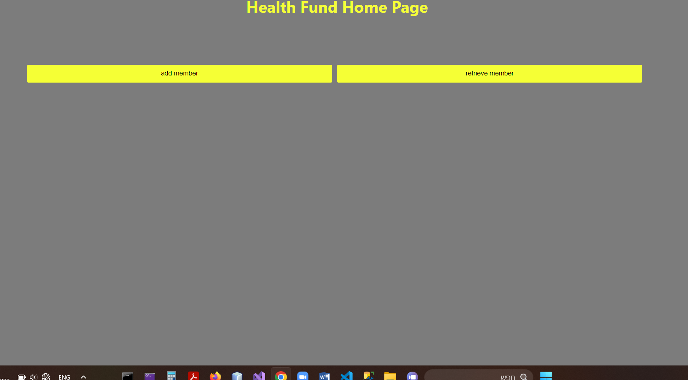
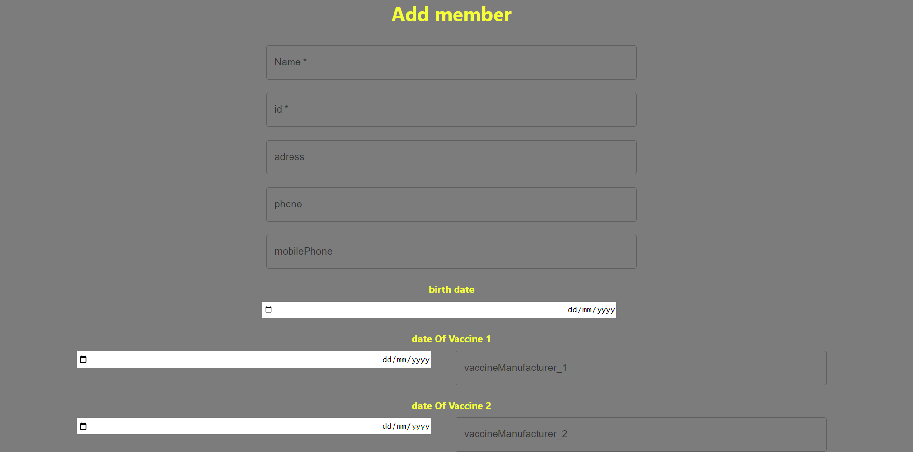
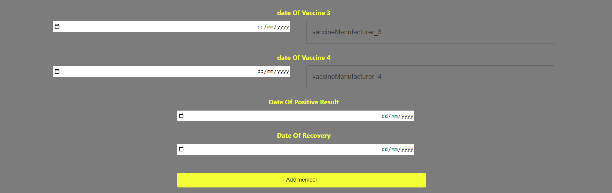
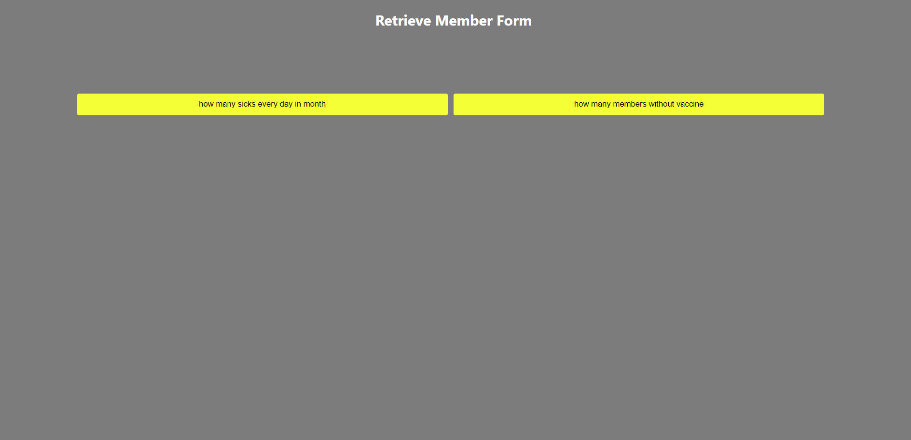
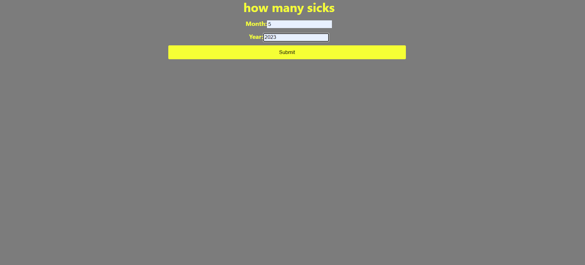
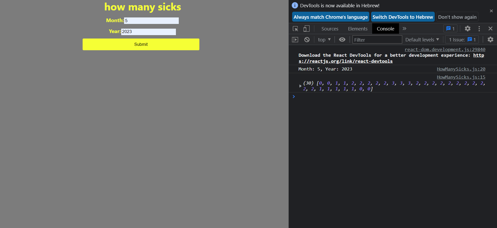
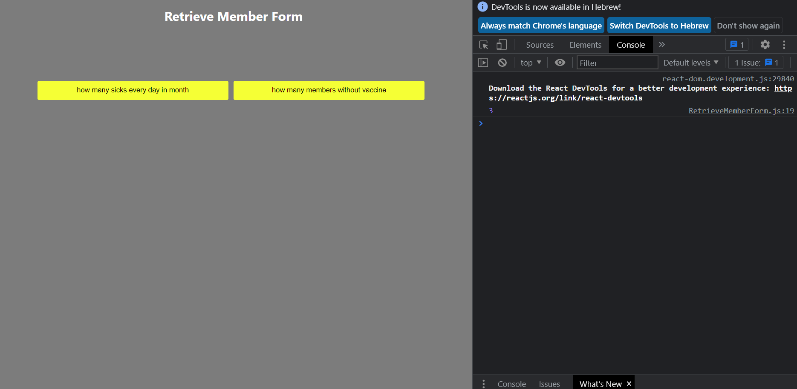

# HMOProject
DB בSQL
ובו 2 טבלאות, טבלת חבר קופה-Member וטבלת חיסון Vaccine .
בכל חיסון יש ID של חבר קופה וכך הוא משתייך אליו.
צד השרת בשפת C#
מורכב מארכיטקטורת 3 השכבות:
•	שכבת ה Repositories-שהיא מחוברת לCONTEXT שמחובר לDB.
•	שכבת ה Services-בה כתובות הפונקציות/אלגוריתם לפי צורך הפרויקט.
•	שכבת ה WebAPI-בה יש Controllers שבהם פעולות שמקבלות או מדפיסות נתונים ועל ידיהם ניגשים לקוד האלגוריתם מצד הלקוח.
בכל שכבה הזרקת תלות של הקודמת לה וכך הנתונים עוברים בשכבות בין הDB לבין צד הלקוח שנכתב בשפת REACT
צד לקוח:
הטופס הראשי:
   
   שבו ישנם 2 כפתורים:
                                                                                                                                         Add Member-להוספת חבר קופה חדש
 
  
                                                                                                                     Retrieve Member-שולף את הנתונים הנדרשים בפונקציות הבאות:
     
                                                         1.how many sicks every day in month-פונקציה בה הייתי צריכה לקבל מהמשתמש חודש ושנה ולהחזיר כמה חולים פעילים בכל יום בחודש הזה.
    
 על פי הנתונים שקיימים במסד הנתונים הקיים לדוג'-הכנסתי את חודש מאי בשנה 2023
התוצאה לא חוזרת באופן גלוי למשתמש אלא בconsole(לחיצה על 12 F) :
  
                                                                                     2.how many mambers without vaccine- בפעולה זו הייתי צריכה למנות כמה מהחברים אינם מחוסנים כלל
התוצאה גם פה תחזור בconsole(לחיצה על 12 F)

 
 
